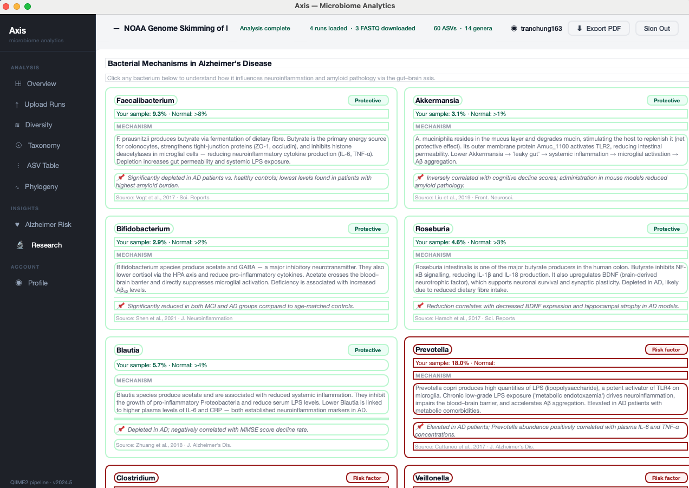

# Axis — Gut Microbiome Analytics for Alzheimer's Research

A desktop application that fetches real gut microbiome sequencing data from public research databases, processes it through a bioinformatics pipeline, and generates diversity analysis alongside a multi-modal Alzheimer's disease risk assessment combining gut microbiome composition, APOE genetics, and optional MRI structural data.

---

## Screenshots

### Login & Register


### Overview


### Diversity Analysis


### Taxonomy


### Alzheimer Risk Assessment


### Biomarker and Research


<!-- ### Profile & Project History
 --> 

---

## What This App Does

Research shows the bacteria living in your gut (the **gut microbiome**) communicate with the brain through the **gut-brain axis** — via the vagus nerve, immune signaling, and metabolites — and may be an early warning signal for Alzheimer's disease. Axis gives researchers a single tool to:

1. Look up any public gut microbiome study by its NCBI database ID
2. Automatically download and process raw DNA sequencing data
3. Identify which bacteria are present and in what proportions
4. Visualize diversity metrics, taxonomic composition, and evolutionary relationships
5. Predict Alzheimer's disease risk using a multi-modal ensemble model (microbiome + APOE genotype + MRI)

---

## Pages & Features

| Page | What it shows |
|---|---|
| **Overview** | Project summary, run metadata, organism and read counts |
| **Upload Runs** | FASTQ download status per run, Run Pipeline button |
| **Diversity** | Alpha diversity boxplots (Shannon, Simpson), beta diversity heatmap, PCoA scatter plot |
| **Taxonomy** | Genus composition stacked bar charts per run, top genera breakdown |
| **ASV Table** | Full amplicon sequence variant feature table |
| **Phylogeny** | Evolutionary tree of detected bacteria with genus-level tip labels |
| **Alzheimer Risk** | Multi-modal AD risk score (microbiome + APOE PRS + MRI), modality contribution bars, biomarker breakdown |
| **Simulation** | Interactive gut microbiome simulation with dietary sliders and 30-day projections |
| **Export PDF** | Full project report export |
| **Profile** | Account info, project history, past runs |

---

## Alzheimer Risk Model

The risk assessment page uses a three-branch ensemble model that combines all available data sources:

```
┌─────────────────────────┐   ┌─────────────────────────┐   ┌─────────────────────────┐
│   Gut Microbiome        │   │   APOE Genotype         │   │   MRI Scan (optional)   │
│   Genus Abundances      │   │   ε2 / ε3 / ε4 copies  │   │   .nii / .nii.gz        │
└────────────┬────────────┘   └────────────┬────────────┘   └────────────┬────────────┘
             │                             │                              │
             ▼                             ▼                              ▼
   XGBoost-style tabular          PRS via published             CNN feature extractor
   dysbiosis scorer               odds ratios                   (volume, variance,
   (19 genera with known          (Farrer 1997 meta-analysis)   asymmetry, atrophy proxy)
   AD associations)
             │                             │                              │
             └─────────────────────────────┴──────────────────────────────┘
                                           │
                                           ▼
                              Weighted logistic meta-layer
                              (Microbiome 35%, APOE 40%, MRI 25%)
                                           │
                                           ▼
                              AD Risk %  ·  Confidence  ·  Low / Moderate / High
```

**Biological evidence base:**
- APOE odds ratios from Farrer et al. 1997 JAMA meta-analysis (ε4ε4 → 8× baseline risk)
- Microbiome genus weights from Vogt et al. 2017, Cattaneo et al. 2017, Liu et al. 2019 meta-analysis
- MRI features proxy hippocampal atrophy and cortical thinning via structural statistics

**MRI preprocessing pipeline** (`src/services/mri_preprocessing.py`):
1. Load NIfTI volume with nibabel
2. Resample to 1 mm isotropic voxels (if needed) via scipy.ndimage.zoom
3. Clip intensity to [1st, 99th] percentile to remove scanner noise
4. Z-score normalise using brain-mask (non-zero) voxel statistics
5. Return float32 `(X, Y, Z)` array, non-brain voxels zeroed

**Swapping in a trained model:** each branch scorer has a documented `.score()` method in `src/services/ad_risk_model.py` that can be replaced with a trained model (e.g. a real XGBoost classifier or 3D-ResNet CNN) — the interface and expected outputs are documented with comments at the top of each class.

---

## Key Terms

| Term | Plain English |
|---|---|
| **NCBI** | The US government's public database for biology research — a library for DNA data |
| **BioProject** (`PRJNA...`) | A study in the NCBI library — a folder containing all data from one research project |
| **SRA Run** (`SRR...`) | One individual DNA sequencing experiment within a study |
| **FASTQ** | Raw output from a DNA sequencer — a text file with millions of DNA reads |
| **16S rRNA sequencing** | Technique used to identify gut bacteria by reading one specific gene that acts as a bacterial barcode |
| **QIIME2** | Software that turns raw FASTQ files into a list of which bacteria are present and how many |
| **DADA2** | Denoising algorithm inside QIIME2 that cleans sequencing errors (like spell-checking DNA) |
| **ASV** | Amplicon Sequence Variant — a unique, error-corrected bacterial barcode |
| **SILVA database** | Reference encyclopedia of known bacterial DNA barcodes used to identify each ASV |
| **Genus** | Biological classification level (above species), e.g. *Bacteroides*, *Prevotella* |
| **Relative abundance** | What percentage of total bacteria in a sample belongs to each genus |
| **Alpha diversity** | How many different bacterial species are in one sample — higher = more diverse |
| **Shannon / Simpson index** | Formulas that measure diversity: Shannon captures variety, Simpson captures dominance |
| **Beta diversity** | How different two samples are from each other (0 = identical, 1 = completely different) |
| **Bray-Curtis dissimilarity** | Standard formula for comparing two microbiome samples |
| **UniFrac** | Like Bray-Curtis, but also considers evolutionary relatedness of the bacteria |
| **PCoA** | Principal Coordinates Analysis — a 2D scatter plot grouping similar samples visually |
| **Phylogenetic tree** | Diagram showing evolutionary relationships between detected bacteria |
| **APOE** | Gene with three variants (ε2, ε3, ε4); ε4 copies are the strongest genetic risk factor for Alzheimer's |
| **PRS** | Polygenic Risk Score — a weighted sum of genetic variants that predicts disease risk |
| **NIfTI (.nii)** | Standard file format for MRI brain scans |
| **Gut-brain axis** | Two-way communication network between gut bacteria and the brain via vagus nerve and immune signaling |

---

## Workflow

```
[1] LOGIN / REGISTER
    Each user has an encrypted local account and project history
          │
          ▼
[2] ENTER BioProject ID (e.g. PRJNA1020741)
    Select max runs (1–20), optionally filter by SRR accession
          │
          ▼
[3] FETCH METADATA from NCBI
    • Find all sequencing runs in the project
    • Get per-run details (read count, library layout, organism)
    • Get project title and description
    Project saved to account history automatically
          │
          ▼
[4] AUTO-DOWNLOAD FASTQ files via fasterq-dump
    • Each run downloaded to data/<BioProject>/fastq/<layout>/
    • QIIME2 manifest files written automatically
    • Upload Runs page shows ✓ Uploaded for each run
    (skipped gracefully if SRA Toolkit is not installed)
          │
          ▼
[5] IN-APP ANALYSIS (automatic)
    • Genus abundance profiles
    • Alpha diversity: Shannon + Simpson (with bootstrap)
    • Beta diversity: Bray-Curtis + UniFrac matrices
    • PCoA: classical MDS
    • Phylogenetic tree for top genera
          │
          ├─── [6A] EXPLORE RESULTS
          │    ┌──────────────┬────────────────────────────────────────────┐
          │    │ Overview     │ Project summary, run status, counts        │
          │    │ Upload Runs  │ Download status, Run Pipeline button       │
          │    │ Diversity    │ Alpha boxplots, beta heatmap, PCoA plot    │
          │    │ Taxonomy     │ Genus stacked bar charts per run           │
          │    │ ASV Table    │ Full feature table with sorting            │
          │    │ Phylogeny    │ Evolutionary tree, genus tip labels        │
          │    │ Alzheimer    │ Multi-modal risk score + biomarkers        │
          │    │ Simulation   │ Dietary intervention projections           │
          │    │ Export PDF   │ Save full project report                   │
          │    └──────────────┴────────────────────────────────────────────┘
          │
          └─── [6B] OPTIONAL: REAL QIIME2 PIPELINE
                    Click "Run Pipeline" on Upload Runs page
                    Requires: QIIME2 conda env + downloaded FASTQ files
                    • Import FASTQ → QC → DADA2 denoising → SILVA classify
                    • Real ASV counts replace in-app results on all pages

[7] ALZHEIMER RISK ASSESSMENT
    On the Alzheimer Risk page:
    • (Optional) Browse and upload a .nii / .nii.gz MRI brain scan
    • Enter APOE allele copy counts (ε2, ε3, ε4 — must sum to 2)
    • Click "Run Assessment"
    • Preprocessing runs in background thread (no UI freeze)
    • Ensemble model combines all available modalities → risk %
```

---

## Project Structure

```
AD-GMB-Diagnosis-App/
├── README.md
├── requirements.txt
├── taxa_classifier/                ← SILVA classifier (.qza) stored here
│
├── data/                           ← local database + downloaded FASTQ files
│   └── axisad.db                   ← AES-256 encrypted SQLite (SQLCipher)
│
└── src/
    ├── main.py                     ← entry point (python src/main.py)
    ├── path_setup.py               ← adds src/ to sys.path for absolute imports
    │
    ├── assets/
    │   └── styles.qss              ← global Qt stylesheet
    │
    ├── models/
    │   ├── app_state.py            ← shared runtime state (AppState, RunState)
    │   ├── data_models.py          ← pure-Python dataclasses
    │   └── example_data.py         ← placeholder data for empty state
    │
    ├── services/
    │   ├── ncbi_service.py         ← fetches BioProject + run metadata from NCBI
    │   ├── analysis_service.py     ← computes diversity metrics and taxonomy
    │   ├── assessment_service.py   ← DB bridge: stores/retrieves runs, genera, diversity
    │   ├── ad_risk_model.py        ← AD risk ensemble (APOE PRS + microbiome + MRI)
    │   ├── mri_preprocessing.py    ← NIfTI load → resample → clip → z-score → float32
    │   └── pdf_exporter.py         ← generates PDF reports
    │
    ├── pipeline/
    │   ├── pipeline.py             ← orchestrates the full QIIME2 pipeline
    │   ├── fetch_data.py           ← downloads FASTQ files via fasterq-dump
    │   ├── qiime_preproc.py        ← QIIME2 steps: import → QC → DADA2 → classify → export
    │   ├── qiime2_runner.py        ← low-level QIIME2 command runner
    │   ├── qc.py                   ← read quality assessment and truncation point detection
    │   ├── db_import.py            ← imports pipeline results into the database
    │   ├── install_dependencies.py ← checks and installs required pipeline tools
    │   └── qiime2.yml              ← conda environment definition for QIIME2
    │
    ├── db/
    │   ├── database.py             ← SQLAlchemy + SQLCipher session setup
    │   ├── db_models.py            ← ORM table definitions
    │   ├── repository.py           ← database query functions
    │   └── init_db.py              ← creates tables on first run
    │
    ├── ui/
    │   ├── main_window.py          ← MainWindow: layout, background QThread workers, page wiring
    │   ├── pages.py                ← all page classes (Overview through Simulation)
    │   ├── auth_page.py            ← login and registration UI
    │   ├── profile_page.py         ← account info and project history
    │   ├── export_page.py          ← PDF export page
    │   ├── sidebar.py              ← left navigation panel
    │   ├── widgets.py              ← reusable primitive widgets
    │   └── helpers.py              ← UI utility functions (card, btn_primary, etc.)
    │
    ├── resources/
    │   └── styles.py               ← colour palette and stylesheet constants
    │
    └── utils/
        └── model.py                ← legacy utility module
```

---

## Setup Guide

### Requirements

- Python >= 3.11
- conda (only needed for the QIIME2 pipeline)
- Internet connection (to fetch data from NCBI)
- `nibabel` + `scipy` (only needed for MRI preprocessing): `pip install nibabel scipy`

---

### Step 1 — Clone the repository

```bash
git clone <repo-url>
cd AD-GMB-Diagnosis-App
```

---

### Step 2 — Create a Python virtual environment

```bash
python -m venv venv
source venv/bin/activate        # Windows: venv\Scripts\activate
```

---

### Step 3 — Install Python dependencies

```bash
pip install -r requirements.txt
```

Core dependencies installed:

| Package | Purpose |
|---|---|
| `PyQt6` | Desktop UI framework |
| `matplotlib` | Charts and plots embedded in Qt |
| `biopython` | NCBI API access + phylogenetic tree parsing |
| `sqlalchemy` | Local database ORM |
| `reportlab` | PDF export |
| `argon2-cffi` | Secure password hashing |
| `numpy` / `pandas` | Numerical and tabular data |
| `pytest` | Test runner |

For MRI support (optional):

```bash
pip install nibabel scipy
```

---

### Step 4 — Set your NCBI email

NCBI requires a valid email for API access. Open `src/services/ncbi_service.py` and set:

```python
ENTREZ_EMAIL = "your-email@example.com"
```

Optionally, get a free API key at [ncbi.nlm.nih.gov/account](https://www.ncbi.nlm.nih.gov/account/) for 10 req/s instead of 3:

```python
ENTREZ_API_KEY = "your-api-key"
```

---

### Step 5 — Install SRA Toolkit (for automatic FASTQ download)

```bash
conda install -c bioconda sra-tools
```

Verify:

```bash
fasterq-dump --version
```

---

### Step 6 — Install QIIME2 for real ASV analysis (optional)

QIIME2 is only needed for real DADA2-based denoising and SILVA taxonomic classification. The app runs full in-app analysis (diversity, taxonomy, AD risk) without it.

> **Apple Silicon Macs (M1/M2/M3/M4):** QIIME2 conda packages are x86_64 only. Use Rosetta 2 emulation via `CONDA_SUBDIR=osx-64`.

```bash
# 6a — Set channel priority
conda config --set channel_priority flexible

# 6b — Download environment file
curl -L -O https://data.qiime2.org/distro/amplicon/qiime2-amplicon-2024.10-py310-osx-conda.yml

# 6c — Remove macOS-incompatible packages
sed -i '' '/deblur/d; /sortmerna/d' qiime2-amplicon-2024.10-py310-osx-conda.yml

# 6d — Create environment (Rosetta emulation on Apple Silicon)
CONDA_SUBDIR=osx-64 conda env create -n qiime2-amplicon-2024.10 \
  --file qiime2-amplicon-2024.10-py310-osx-conda.yml

# 6e — Lock environment to x86_64
conda activate qiime2-amplicon-2024.10
conda config --env --set subdir osx-64

# 6f — Verify
qiime --version
```

This step downloads ~3–5 GB and takes 10–20 minutes. The SILVA classifier (~1.4 GB) is downloaded automatically on the first pipeline run.

**Windows:** Use WSL2 and follow the Linux instructions (omit `CONDA_SUBDIR=osx-64`).

---

### Step 7 — Run the app

```bash
python src/main.py
```

The app opens immediately. You can enter any BioProject accession and explore analysis results — no QIIME2 needed for this mode.

---

## Usage

### Standard workflow

```
1. Launch:      python src/main.py
2. Register or log in
3. Overview:    Enter a BioProject accession (e.g. PRJNA1020741) → Fetch
4. Upload Runs: FASTQ files download automatically
5. All pages populate with diversity, taxonomy, and risk data
6. Alzheimer:   Enter APOE genotype, optionally upload a .nii MRI → Run Assessment
7. [Optional]   Click "Run Pipeline" for real QIIME2 DADA2 results
```

### Example BioProject accessions

| Accession | Description |
|---|---|
| `PRJNA1020741` | Human gut microbiome study |
| `PRJNA1028813` | Use run `SRR26409620` |
| `PRJNA31257` | Homo sapiens gut microbiome |
| `PRJNA743840` | Human gut 16S rRNA amplicon study |

### Without SRA Toolkit

The app fetches NCBI metadata and runs in-app analysis with biologically realistic genus profiles. A warning appears on the Upload Runs page with install instructions.

### Without QIIME2

The Run Pipeline button checks for QIIME2 first. If not found, an error is shown with instructions. The app does not silently fall back — all other pages work normally without it.

### Without MRI

The Alzheimer Risk assessment runs on microbiome + APOE alone. The MRI weight is redistributed proportionally between the other two branches. Upload a `.nii` file to activate the structural branch.

---

## Two Analysis Modes

| Mode | Requires | How it works |
|---|---|---|
| **In-app analysis** | Nothing extra | Genus profiles from literature; real Shannon/Simpson/Bray-Curtis math; classical MDS PCoA |
| **Real QIIME2 pipeline** | QIIME2 env + fasterq-dump | Downloads FASTQ → DADA2 denoising → SILVA classification → real ASV counts |

When real pipeline results are available they replace the in-app results on all pages.

---

## Architecture Notes

The UI never calls the pipeline or database directly. All analysis logic flows through `MainWindow` via explicit `page.load(state: AppState)` calls. This means all services can be tested without starting the Qt application.

| Concern | Location |
|---|---|
| Shared runtime state | `models/app_state.py` |
| NCBI API calls | `services/ncbi_service.py` |
| Diversity + taxonomy computation | `services/analysis_service.py` |
| Database read/write | `db/` + `services/assessment_service.py` |
| AD risk ensemble model | `services/ad_risk_model.py` |
| MRI preprocessing | `services/mri_preprocessing.py` |
| PDF report generation | `services/pdf_exporter.py` |
| QIIME2 pipeline steps | `pipeline/` |
| UI pages and layout | `ui/pages.py` |
| Background threading | `ui/main_window.py` (QThread workers) |
| Theming and styles | `resources/styles.py` + `assets/styles.qss` |

---

## Running Tests

```bash
pytest tests/ -v
```

---

## Disclaimer

Axis is a research-grade tool. All risk estimates are experimental and based on published literature — they are **not** clinical diagnoses. Consult a qualified physician for any medical assessment.
