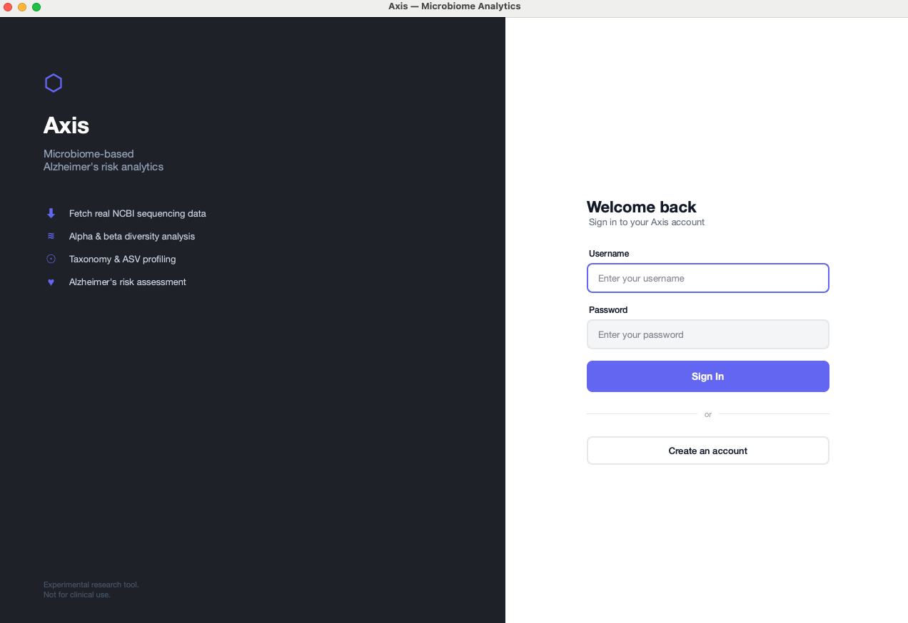
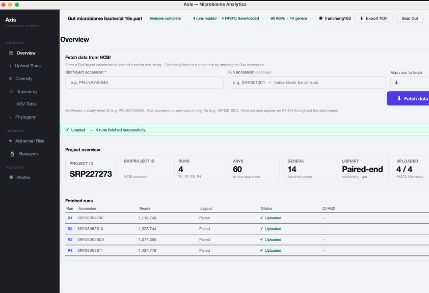
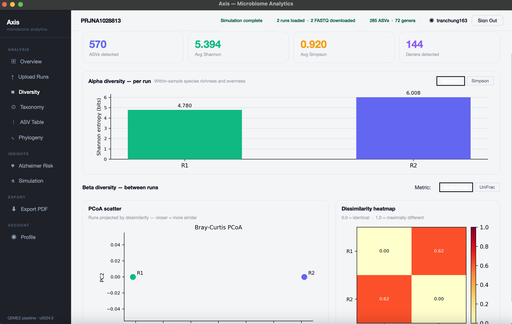
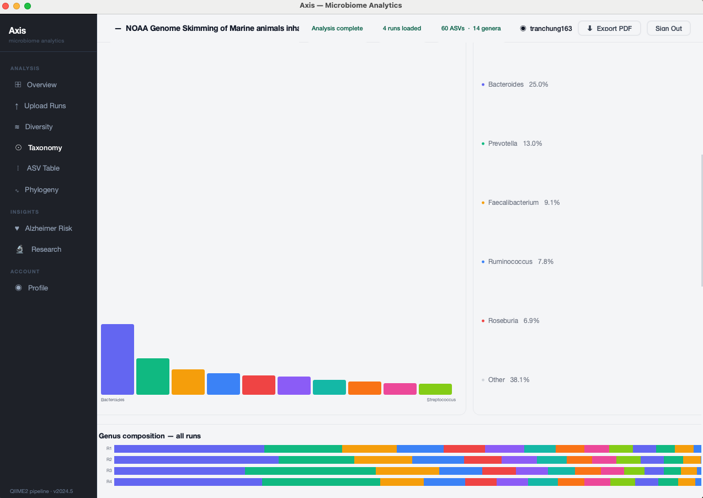
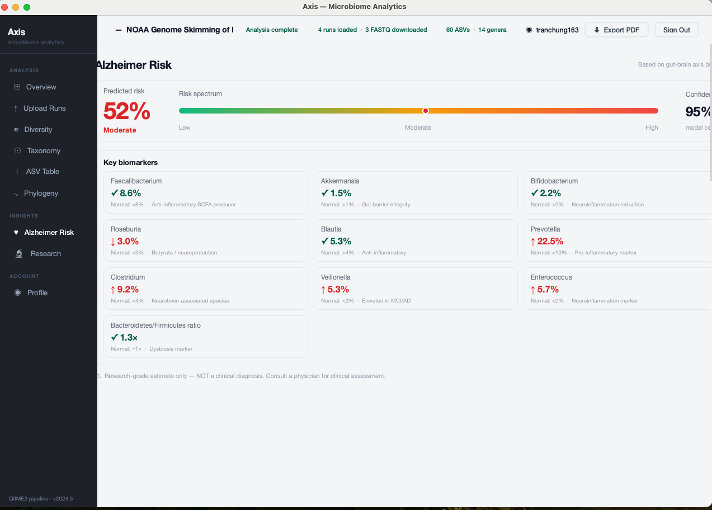
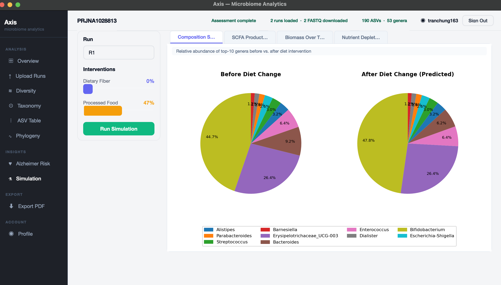

# Axis — Gut Microbiome Analytics for Alzheimer's Research

A PyQt6 desktop application that fetches real gut microbiome sequencing data from public research databases, processes it through a QIIME2 bioinformatics pipeline, computes diversity analytics, and generates a multi-modal Alzheimer's disease risk assessment combining gut microbiome composition, APOE genetics, and optional MRI structural data.

---

## Screenshots

### Login & Register


### Overview


### Diversity Analysis


### Taxonomy


### Alzheimer Risk Assessment


### Gut Microbiome Simulation


---

## What This App Does

Research shows the bacteria living in your gut (the **gut microbiome**) communicate with the brain through the **gut-brain axis** — via the vagus nerve, immune signaling, and metabolites — and may be an early warning signal for Alzheimer's disease. Axis gives researchers a single tool to:

1. Look up any public gut microbiome study by its NCBI BioProject ID
2. Automatically download and process raw 16S rRNA sequencing data (FASTQ)
3. Identify which bacteria are present and in what proportions via QIIME2 + SILVA classification
4. Visualize diversity metrics, taxonomic composition, and evolutionary relationships
5. Predict Alzheimer's disease risk using a multi-modal ensemble model (microbiome + APOE genotype + optional MRI)
6. Simulate how dietary interventions change the microbiome composition using constraint-based metabolic models (dFBA via COBRA + AGORA2)

---

## Pages & Features

| Page | What it shows |
|---|---|
| **Overview** | BioProject fetch, project summary, run metadata, organism and read counts |
| **Upload Runs** | FASTQ download status per run, Run Pipeline button |
| **Diversity** | Alpha diversity box plots (Shannon, Simpson), beta diversity heatmap (Bray-Curtis + UniFrac), PCoA scatter plot |
| **Taxonomy** | Genus composition stacked bar charts per run, top-genus breakdown table |
| **ASV Table** | Full amplicon sequence variant feature table with sortable columns |
| **Phylogeny** | Evolutionary tree of detected bacteria inferred with MAFFT + FastTree2 |
| **Alzheimer Risk** | Multi-modal AD risk score, SHAP genus contributions, APOE input, optional MRI upload |
| **Simulation** | dFBA gut microbiome simulation with dietary sliders — composition shift, SCFA production, biomass growth, nutrient depletion |
| **Export PDF** | Full project report export with all charts and statistics |
| **Profile** | Account info, project history, past runs |

---

## Alzheimer Risk Model

The risk page uses a three-branch ensemble loaded from pre-trained pickle files (`src/risk/`). The subprocess runner (`run_assess.py`) calls `risk-assessment.py` in an isolated Python environment to avoid dependency conflicts with the main Qt process.

```
┌─────────────────────────┐   ┌─────────────────────────┐   ┌─────────────────────────┐
│   Gut Microbiome        │   │   APOE Genotype         │   │   MRI Scan (optional)   │
│   Top-20 genus CLR      │   │   ε2 / ε3 / ε4 copies  │   │   .nii / .nii.gz        │
└────────────┬────────────┘   └────────────┬────────────┘   └────────────┬────────────┘
             │                             │                              │
             ▼                             ▼                              ▼
    XGBoost microbiome              XGBoost genetic              3D-CNN feature extractor
    dysbiosis scorer                branch (APOE features)       ImagingCNN (Conv3d)
    (20 genera with known                                         resized to 128³ voxels
    AD associations)
             │                             │                              │
             └─────────────────────────────┴──────────────────────────────┘
                                           │
                                           ▼
                              LogisticRegression meta-layer
                              (microbiome + tabular + imaging branches)
                                           │
                                           ▼
                         AD Risk %  ·  Confidence  ·  Low / Moderate / High
                         + top-8 contributing genera via XGBoost native SHAP
```

**Top-20 microbiome genera used as features:**
Bacteroides, Bifidobacterium, Enterococcus, Prevotella, Akkermansia, Veillonella, Clostridium, Eubacterium, Anaerostipes, Lachnospiraceae, Lachnoclostridium, Blautia, Roseburia, Dorea, Odoribacter, UCG-002, UCG-005, Faecalibacterium, Alistipes, Marvinbryantia

**Model files required** (place in `src/risk/`):
- `risk-assess-gmb.pkl` — microbiome-only model
- `risk-assess-tab.pkl` — microbiome + genetic tabular model
- `risk-assess-full.pkl` — full ensemble including imaging
- `imaging_cnn_weights.pt` — CNN weights (required for full model only)

If the pickle files are absent the app falls back to a heuristic model in `src/services/ad_risk_model.py` using published APOE odds ratios (Farrer 1997) and literature genus dysbiosis weights.

**MRI preprocessing** (`src/risk/risk-assessment.py` + `src/services/mri_preprocessing.py`):
1. Load NIfTI volume with nibabel
2. Resize to 128³ voxels via `scipy.ndimage.zoom` (order=1 bilinear)
3. Z-score normalise within brain mask (non-zero voxels)
4. Return `float32 (1, 128, 128, 128)` tensor

**Subprocess isolation:** the risk scorer runs `risk-assessment.py` in a separate Python process to avoid `xgboost`/`libomp` conflicts with the Qt process. The runner probes common venv and conda paths for a Python interpreter that has `xgboost` installed.

---

## Gut Microbiome Simulation

The Simulation page runs a **dynamic Flux Balance Analysis (dFBA)** model using COBRA and genome-scale metabolic reconstructions from **AGORA2** (2,850+ bacterial SBML models).

```
User sliders (fiber ↑, junk food ↑, antibiotics, probiotics)
        │
        ▼
apply_user_input() — scale nutrient fluxes in Western Diet TSV
        │
        ▼
For each genus in top-10 microbiome profile:
  • Extract AGORA2 SBML model from zip archive on demand
  • Load into COBRA, maximize biomass objective
  • Record growth rate, SCFA fluxes, nutrient uptake per time step
        │
        ▼
30-step time integration (Euler method, dt = 1)
        │
        ▼
4 output tabs (QTabWidget):
  • Composition Shift  — side-by-side pie charts before/after, shared genus legend
  • SCFA Production    — stacked bar (butyrate, acetate, propionate, formate log flux)
  • Biomass Growth     — line chart per genus across time steps
  • Nutrient Depletion — 4-panel line chart (one panel per SCFA metabolite, all genera overlaid)
```

AGORA2 models ship as a ~2 GB zip file. The app extracts individual genus models on demand — see **Setup Step 7**.

---

## Key Terms

| Term | Plain English |
|---|---|
| **NCBI** | US government public database for biology research |
| **BioProject** (`PRJNA…`) | A study folder in NCBI containing all data from one research project |
| **SRA Run** (`SRR…`) | One individual DNA sequencing experiment within a study |
| **FASTQ** | Raw DNA sequencer output — millions of reads as text |
| **16S rRNA sequencing** | Technique identifying gut bacteria by sequencing one conserved barcode gene |
| **QIIME2** | Bioinformatics toolkit turning raw FASTQ files into a bacteria composition profile |
| **Deblur** | Denoising algorithm inside QIIME2 that removes sequencing errors |
| **ASV** | Amplicon Sequence Variant — a unique, error-corrected bacterial sequence |
| **SILVA** | Reference encyclopedia of known bacterial DNA barcodes used for taxonomy assignment |
| **Genus** | Bacterial classification level above species (e.g. *Bacteroides*, *Prevotella*) |
| **CLR** | Centered Log-Ratio — compositional transformation applied before ML |
| **Alpha diversity** | How diverse one sample is (Shannon = variety, Simpson = dominance) |
| **Beta diversity** | How different two samples are from each other (0 = identical, 1 = totally different) |
| **Bray-Curtis** | Standard pairwise microbiome dissimilarity formula |
| **UniFrac** | Like Bray-Curtis but weights differences by evolutionary relatedness |
| **PCoA** | Principal Coordinates Analysis — 2D scatter grouping similar samples visually |
| **APOE** | Gene with three variants (ε2/ε3/ε4); ε4 copies are the strongest Alzheimer's genetic risk |
| **SHAP** | SHapley Additive exPlanations — shows how much each genus drove the risk score |
| **NIfTI (.nii)** | Standard file format for MRI brain scans |
| **dFBA** | Dynamic Flux Balance Analysis — time-integrated constraint-based metabolic model |
| **AGORA2** | Database of 2,850+ genome-scale metabolic reconstructions of human gut bacteria |
| **COBRA** | Python toolkit for constraint-based metabolic modeling |
| **Gut-brain axis** | Two-way communication between gut bacteria and the brain |

---

## Workflow

```
[1] LOGIN / REGISTER
    Encrypted local account — AES-GCM master key derived via PBKDF2 (600k iterations)
    Database encrypted at rest with SQLCipher (AES-256)
          │
          ▼
[2] ENTER BioProject ID (e.g. PRJNA1028813)
    Select max runs (1–20), optionally filter by SRR accession
          │
          ▼
[3] FETCH METADATA from NCBI
    • SRA esearch → efetch runinfo CSV → BioProject esummary
    • Filters to Illumina 16S amplicon runs only
    • Fallback to EBI ENA API if NCBI is unavailable
    • Project saved to account history automatically
          │
          ▼
[4] AUTO-DOWNLOAD FASTQ files
    • fasterq-dump (SRA Toolkit) or EBI ENA FTP fallback
    • QIIME2 manifest TSV written automatically per layout
    • Upload Runs page shows status per run
          │
          ▼
[5] OPTIONAL: RUN QIIME2 PIPELINE
    Click "Run Pipeline" on the Upload Runs page
    Requires: QIIME2 conda env (qiime2-amplicon-2024.10) + downloaded FASTQ files
    • FASTQ import → demux QC → truncation detection → Deblur denoising
    • SILVA taxonomy classification (classifier auto-downloaded on first run)
    • Export: feature-table.tsv, genus-table.tsv, taxonomy.tsv, dna-sequences.fasta
    • MAFFT multiple sequence alignment + FastTree2 phylogenetic tree
    • Ingest all outputs into encrypted SQLCipher database
          │
          ▼
[6] IN-APP ANALYSIS (automatic after pipeline)
    • Genus relative abundance per run
    • Alpha diversity: Shannon (−Σ pᵢ log₂ pᵢ) + Simpson (1 − Σ pᵢ²)
    • Beta diversity: Bray-Curtis (pure NumPy) + Weighted UniFrac (pure Python)
    • PCoA: classical MDS via numpy.linalg.eigh with double-centering
          │
          ▼
[7] ALZHEIMER RISK ASSESSMENT
    On the Alzheimer Risk page:
    • (Optional) Upload .nii / .nii.gz MRI scan → preprocessed to 128³ float32
    • Enter APOE allele counts (ε2, ε3, ε4 — must sum to 2)
    • Click "Run Assessment" — subprocess calls risk-assessment.py
    • Returns: risk %, confidence %, risk level, top-8 SHAP genus contributions
          │
          ▼
[8] GUT MICROBIOME SIMULATION
    On the Simulation page:
    • Adjust dietary sliders (fiber, junk food, antibiotics, probiotics)
    • Select number of genera and time steps
    • Click "Run Simulation" — dFBA via COBRA + AGORA2 SBML models
    • Returns: composition shift, SCFA production, biomass lines, nutrient depletion
          │
          ▼
[9] EXPORT PDF
    Generates a full multi-section report with all charts and statistics
```

---

## Project Structure

```
AD-GMB-Diagnosis-App/
├── README.md
├── requirements.txt
│
├── data/
│   ├── axisad.db               ← AES-256 encrypted SQLite (SQLCipher) — auto-created
│   ├── key_vault.json          ← per-user encrypted master keys — auto-created
│   └── models/                 ← trained ML model artifacts (not in repo)
│
└── src/
    ├── main.py                 ← entry point: python src/main.py
    ├── path_setup.py           ← adds project root to sys.path
    │
    ├── db/
    │   ├── database.py         ← SQLAlchemy + SQLCipher engine, init_engine(), SessionProxy
    │   ├── db_models.py        ← ORM tables: User, Project, Run, Genus, Feature,
    │   │                          FeatureCount, Tree, AlphaDiversity, BetaDiversity,
    │   │                          PCoA, Simulation
    │   ├── init_db.py          ← creates all tables on first run
    │   ├── key_vault.py        ← PBKDF2+AES-GCM master key management
    │   └── repository.py       ← all low-level DB query functions
    │
    ├── models/
    │   ├── app_state.py        ← AppState + RunState dataclasses (single source of truth)
    │   ├── data_models.py      ← pure-Python dataclasses for pipeline outputs
    │   └── example_data.py     ← placeholder data for empty/demo state
    │
    ├── services/
    │   ├── assessment_service.py  ← service layer: auth, run ingest, diversity store/fetch,
    │   │                             risk persist, simulation history
    │   ├── ncbi_service.py        ← NCBI Entrez API (esearch, efetch, esummary) + EBI fallback
    │   ├── analysis_service.py    ← in-app diversity simulation (fallback when no QIIME2 output)
    │   ├── ad_risk_model.py       ← heuristic AD risk model + model class definitions
    │   │                             required for pickle deserialization
    │   ├── mri_preprocessing.py   ← NIfTI load → resize 128³ → z-score → float32
    │   └── pdf_exporter.py        ← ReportLab Platypus PDF export (8-section report)
    │
    ├── pipeline/
    │   ├── pipeline.py            ← high-level orchestration (fetch → preprocess → ingest)
    │   ├── fetch_data.py          ← fasterq-dump / ENA FTP download + manifest writer
    │   ├── qiime_preproc.py       ← QIIME2 steps: import → QC → Deblur → SILVA →
    │   │                             export TSV/FASTA → MAFFT/FastTree2 phylogeny
    │   ├── qiime2_runner.py       ← QiimeRunner subprocess wrapper + AGORA2 extractor
    │   ├── qc.py                  ← truncation length detection from demux QC summary
    │   ├── db_import.py           ← parse TSV/FASTA → dicts (clean_genus,
    │   │                             parse_genus_table, parse_feat_tax_seqs,
    │   │                             parse_feature_counts)
    │   ├── install_dependencies.py ← micromamba + QIIME2 conda env setup
    │   ├── qiime2.yml             ← macOS conda environment definition
    │   ├── qiime2-linux.yml       ← Linux conda environment definition
    │   ├── ref_phylo_db/          ← SEPP reference phylogeny (auto-downloaded)
    │   └── taxa_classifier/       ← SILVA classifier .qza (auto-downloaded)
    │
    ├── risk/
    │   ├── risk-assessment.py     ← standalone ML scoring script called as subprocess
    │   │                             reads JSON from stdin, writes JSON to stdout
    │   │                             models: gmb-only, tabular (gmb+genetic), full (gmb+genetic+MRI)
    │   ├── run_assess.py          ← discovers Python with xgboost, spawns subprocess,
    │   │                             returns result dict
    │   └── models.py              ← AlzheimerRiskEnsemble, TabularModel, ImagingCNN,
    │                                 ImagingModel class definitions
    │
    ├── simulation/
    │   ├── simulate_gmb.py        ← dFBA simulation (COBRA + AGORA2) + 4 Matplotlib charts
    │   └── WesternDietAGORA2.tsv  ← baseline Western diet metabolite exchange fluxes
    │
    ├── ui/
    │   ├── main_window.py         ← MainWindow + 10 QThread worker classes:
    │   │                             _FetchWorkerReal, _DownloadWorkerReal,
    │   │                             _CheckEnvWorker, _PipelineWorkerReal,
    │   │                             _ParseWorkerReal, _AnalysisWorkerReal,
    │   │                             _PhylogenyWorker, _UnifracWorker,
    │   │                             _RiskPredictionWorker, _SimulationWorker
    │   ├── pages.py               ← 8 page classes: OverviewPage, UploadRunsPage,
    │   │                             DiversityPage, TaxonomyPage, AsvTablePage,
    │   │                             PhylogenyPage, AlzheimerPage, SimulationPage
    │   ├── auth_page.py           ← login and registration UI
    │   ├── profile_page.py        ← account info and project history
    │   ├── export_page.py         ← PDF export page
    │   ├── sidebar.py             ← left navigation panel
    │   ├── widgets.py             ← custom QPainter widgets: BarChartWidget,
    │   │                             StackedBarWidget, BoxPlotWidget, PCoAWidget,
    │   │                             HeatmapWidget, RiskMeterWidget, GenusTableWidget,
    │   │                             NumericSortItem, _AlphaBarWidget
    │   └── helpers.py             ← styled widget factories: card(), btn_primary(),
    │                                 stat_card(), PillSwitcher, hdivider() …
    │
    ├── resources/
    │   └── styles.py              ← colour palette constants (GENUS_COLORS, TEXT_M …)
    │
    └── utils/
        └── model.py               ← legacy utility module
```

---

## Setup Guide

### Requirements

- Python ≥ 3.11
- `conda` / `micromamba` — only needed for the QIIME2 pipeline
- Internet connection (to fetch NCBI metadata and download FASTQ files)

---

### Step 1 — Clone the repository

```bash
git clone <repo-url>
cd AD-GMB-Diagnosis-App
```

---

### Step 2 — Create a Python virtual environment

```bash
python -m venv venv
source venv/bin/activate        # Windows: venv\Scripts\activate
```

---

### Step 3 — Install Python dependencies

```bash
pip install -r requirements.txt
```

Key packages:

| Package | Purpose |
|---|---|
| `PyQt6` | Desktop UI framework |
| `matplotlib` | Charts embedded in Qt via FigureCanvasQTAgg |
| `sqlalchemy` | ORM for encrypted local database |
| `sqlcipher3` | AES-256 encrypted SQLite driver |
| `cryptography` | AES-GCM key wrapping in key_vault |
| `argon2-cffi` | Argon2 password hashing |
| `biopython` | NCBI Entrez API + phylogenetic tree parsing |
| `reportlab` | PDF report generation |
| `numpy` / `pandas` | Numerical and tabular processing |
| `cobra` | Constraint-based metabolic modelling for dFBA simulation |
| `nibabel` / `scipy` | NIfTI MRI loading and resampling |
| `xgboost` | ML risk assessment (install in a separate env — see Step 8) |

> **macOS note:** `sqlcipher3` requires the SQLCipher C library. Install it first with `brew install sqlcipher` if pip fails.

---

### Step 4 — Set your NCBI email

NCBI requires a valid email for Entrez API access. Open `src/services/ncbi_service.py` and set:

```python
ENTREZ_EMAIL = "your-email@example.com"
```

Optionally get a free API key at [ncbi.nlm.nih.gov/account](https://www.ncbi.nlm.nih.gov/account/) for 10 req/s instead of 3:

```python
ENTREZ_API_KEY = "your-api-key"
```

---

### Step 5 — Install SRA Toolkit (for automatic FASTQ download)

```bash
conda install -c bioconda sra-tools
```

Verify:

```bash
fasterq-dump --version
```

If SRA Toolkit is not installed the app automatically falls back to ENA FTP downloads.

---

### Step 6 — Install QIIME2 for real ASV analysis (optional)

QIIME2 is only needed for the "Run Pipeline" button (Deblur denoising + SILVA classification). All other pages work without it.

> **Apple Silicon Macs (M1/M2/M3/M4):** QIIME2 conda packages are x86_64 only — use Rosetta 2 emulation.

```bash
# Set channel priority
conda config --set channel_priority flexible

# Download environment file (run from src/pipeline/)
cd src/pipeline
curl -L -O https://data.qiime2.org/distro/amplicon/qiime2-amplicon-2024.10-py310-osx-conda.yml

# Remove macOS-incompatible packages
sed -i '' '/deblur/d; /sortmerna/d' qiime2-amplicon-2024.10-py310-osx-conda.yml

# Create environment (add CONDA_SUBDIR=osx-64 on Apple Silicon)
CONDA_SUBDIR=osx-64 conda env create -n qiime2-amplicon-2024.10 \
  --file qiime2-amplicon-2024.10-py310-osx-conda.yml

# Lock to x86_64 (Apple Silicon only)
conda activate qiime2-amplicon-2024.10
conda config --env --set subdir osx-64

# Verify
qiime --version
```

This downloads ~3–5 GB and takes 10–20 minutes. The SILVA classifier (~1.4 GB) is downloaded automatically on the first pipeline run.

**Linux:** Omit `CONDA_SUBDIR=osx-64`.  
**Windows:** Use WSL2 and follow the Linux instructions.

---

### Step 7 — Download AGORA2 models for gut microbiome simulation

The simulation uses AGORA2 genome-scale metabolic models (~2 GB). Download the zip into `src/simulation/`:

```bash
cd src/simulation
curl -L -O "https://www.vmh.life/files/reconstructions/AGORA2/version2.01/sbml_files_fixed/zipped/AGORA2_models/AGORA2_SBML.zip"
```

The app extracts individual genus SBML files on demand — no manual extraction needed.

---

### Step 8 — Install xgboost for risk assessment (optional)

The ML risk scorer runs in an isolated subprocess. Create a separate environment:

```bash
python -m venv risk_env
source risk_env/bin/activate
pip install xgboost numpy pandas scikit-learn
```

The runner (`src/risk/run_assess.py`) automatically discovers this environment by probing for Python interpreters that can `import xgboost`. Environments searched (in order): `biomicro-venv`, `venv`, `.venv`, `ml_env`, `env`, `mlenv`, `risk_env`.

> **macOS:** If you see `libomp.dylib` errors, run `conda install llvm-openmp` inside the risk environment.

---

### Step 9 — Run the app

```bash
python src/main.py
```

The app opens immediately. Register an account, enter any BioProject accession, and start exploring. QIIME2 is not required to use the Overview, Diversity, Taxonomy, Alzheimer Risk, or Simulation pages.

---

## Usage

### Standard workflow

```
1. Launch:       python src/main.py
2. Register or log in (creates encrypted local account)
3. Overview:     Enter BioProject accession (e.g. PRJNA1028813) → Fetch
4. Upload Runs:  FASTQ files download automatically
5. Pipeline:     Click "Run Pipeline" for real Deblur + SILVA results (optional)
6. Diversity:    Shannon/Simpson box plots, Bray-Curtis/UniFrac heatmap, PCoA scatter
7. Taxonomy:     Genus stacked bars, sortable genus abundance table
8. Phylogeny:    Tree inferred from MAFFT + FastTree2
9. Alzheimer:    Enter APOE counts, optionally upload .nii MRI → Run Assessment
10. Simulation:  Adjust dietary sliders → Run Simulation → view dFBA projections
11. Export:      Save full PDF report
```

### Example BioProject accessions

| Accession | Notes |
|---|---|
| `PRJNA1028813` | Works well; try runs SRR26409621–SRR26409626 |
| `PRJNA1020741` | Human gut microbiome study |
| `PRJNA743840` | Human gut 16S rRNA amplicon study |
| `PRJNA31257` | Homo sapiens gut microbiome |

### Without SRA Toolkit

The app falls back to ENA FTP downloads automatically.

### Without QIIME2

The Run Pipeline button shows an error with setup instructions. All other pages are fully functional using previously ingested data.

### Without MRI

The risk assessment runs on microbiome + APOE alone (gmb or tab model). Upload a `.nii` or `.nii.gz` to activate the full three-branch ensemble.

### Without trained model files

If the `.pkl` files are absent from `src/risk/`, the app uses the heuristic fallback in `src/services/ad_risk_model.py`. The UI is identical; only the source of the numbers changes.

---

## Architecture

### Layered design

```
UI layer (PyQt6 pages)
    │  page.load(state: AppState) — unidirectional data flow
    ▼
MainWindow — coordinates QThread workers and state broadcast
    │
    ├── QThread workers (all blocking I/O and computation off the UI thread)
    │      _FetchWorkerReal       → NCBI metadata fetch
    │      _DownloadWorkerReal    → FASTQ download
    │      _CheckEnvWorker        → QIIME2 environment probe
    │      _PipelineWorkerReal    → QIIME2 pipeline execution
    │      _ParseWorkerReal       → TSV/FASTA output parsing
    │      _AnalysisWorkerReal    → alpha/beta/PCoA diversity computation
    │      _PhylogenyWorker       → MAFFT + FastTree2 tree inference
    │      _UnifracWorker         → Weighted UniFrac distances + PCoA
    │      _RiskPredictionWorker  → ML risk assessment (subprocess)
    │      _SimulationWorker      → dFBA simulation (COBRA + AGORA2)
    │
    ▼
Service layer  (assessment_service, ncbi_service, analysis_service)
    │
    ▼
Repository layer  (db/repository.py — all SQL lives here)
    │
    ▼
SQLCipher database  (data/axisad.db — AES-256 encrypted SQLite)
```

### State management

`AppState` (`src/models/app_state.py`) is the single source of truth for all runtime data. Workers receive a reference to `AppState`, mutate it, and emit a `finished` signal. `MainWindow` receives the signal and calls `page.load(state)` on every registered page. Pages never write to the state directly.

### Diversity algorithms — pure Python, no scikit-bio

| Metric | Formula / method |
|---|---|
| Shannon index | `−Σ pᵢ log₂ pᵢ` over ASV count vector |
| Simpson index | `1 − Σ pᵢ²` over ASV count vector |
| Bray-Curtis | `Σ|uᵢ−vᵢ| / Σ(uᵢ+vᵢ)` via NumPy pairwise loop |
| Weighted UniFrac | Iterative postorder on pruned Newick tree; no skbio dependency |
| PCoA | Classical MDS: double-centre D² matrix → `numpy.linalg.eigh` → top-2 eigenvectors × √eigenvalue |

### Security model

| Layer | Mechanism |
|---|---|
| Password storage | Argon2 hash (argon2-cffi) in User table |
| Master key generation | `secrets.token_bytes(32)` at registration |
| Master key storage | PBKDF2-HMAC-SHA256 (600,000 iterations) + AES-GCM; written to `data/key_vault.json` |
| Database encryption | SQLCipher AES-256; PRAGMA key derived from master key at login |
| Session isolation | Master key lives in memory only; never written to disk in plaintext |

---

## Running Tests

```bash
pytest tests/ -v
```

---

## Troubleshooting

| Symptom | Cause | Fix |
|---|---|---|
| `file is not a database` at login | DB file format mismatch (e.g. after switching branches that changed encryption) | Delete `data/axisad.db` and `data/key_vault.json`, then re-register |
| `libomp.dylib not found` during risk assessment | OpenMP missing on macOS | `conda install llvm-openmp` inside the xgboost Python environment |
| `qiime_preprocess() got unexpected keyword argument` | Stale `.pyc` cache or branch merge conflict | `find src -name "*.pyc" -delete` then restart |
| `KeyError: 'SRRxxxxxxx'` during pipeline | Stale QIIME2 cache from a previous run with different SRRs | Delete `data/<BioProject>/qiime/` and rerun |
| QIIME2 not found | Conda env not created or wrong name | Follow Setup Step 6; env must be named `qiime2-amplicon-2024.10` |
| Simulation crashes on start | AGORA2 zip not present | Follow Setup Step 7 |
| Risk assessment returns `{"stderr": "..."}` | xgboost Python environment not found | Follow Setup Step 8; verify name matches `_VENV_NAMES` in `src/risk/run_assess.py` |

---

## Disclaimer

Axis is a research-grade tool. All risk estimates are experimental and based on published literature — they are **not** clinical diagnoses. Consult a qualified physician for any medical assessment.
